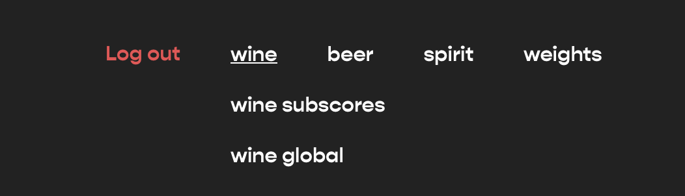
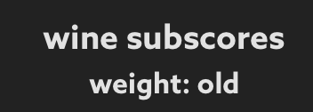
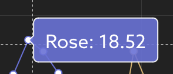
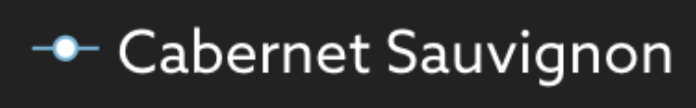
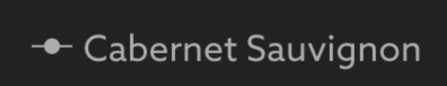
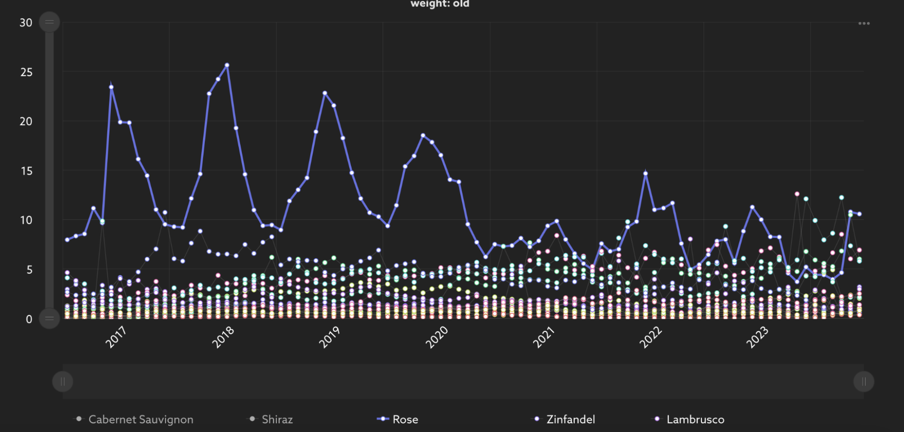
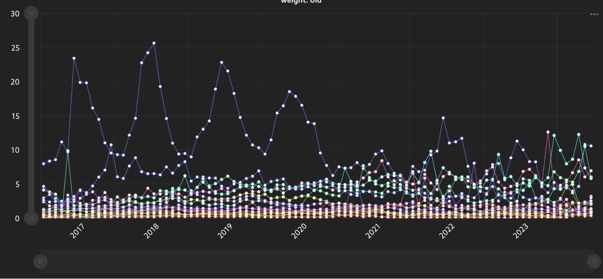
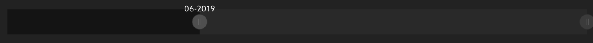
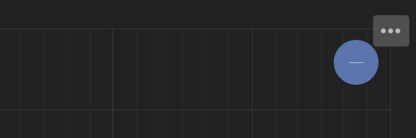
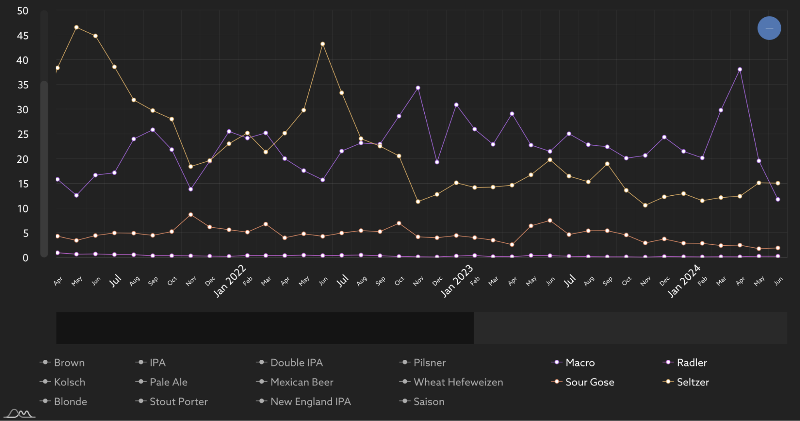

# VinePair Audience Insights Dashboard
VinePair internal dashboard displaying trends for 65 different types of wines, beers, and spirits. Created with Amcharts, React.js, and Firebase Authentication.

# Features
1. Google Login for VinePair emails
2. Drop Down for Each Master Beverage Category
3. Weights Selection
4. Export Visible Series in Selected Time Range

## Login Page
* Google Sign-in for company emails (example@vinepair.com)
* Sign-in will not authorize non-VinePair emails
## Dashboard Page
### Headers
* Weighting defaults to OLD
* Beverage type and score options

* Weighting type is displayed underneath the displayed beverage and weighting

### Navigating The Chart
* Hover to view beverage and score for any given data point

* To hide other beverages, click on the legend for that beverage. The line graph will drop from the chart.

    

        
        
Line graph hidden

    

    

        
        
Line graph displayed

    

* Hover over legend to emphasize the line graph

    
    
“Rose” Hovered

    
    
“Rose” not hovered

* Slide the bottom bar to adjust the time range

    

* Slide the left bar to adjust the share-of-voice.

### Exporting
* The export button is the three dots (...) on the top right corner of the graph.

    

* Export only exports visible line graphs within the time range of the bottom slider bar.

    
    
Chart only displays and exports Macro, Sour Gose, Radler, and Seltzer from Apr 2021 - June 2024

